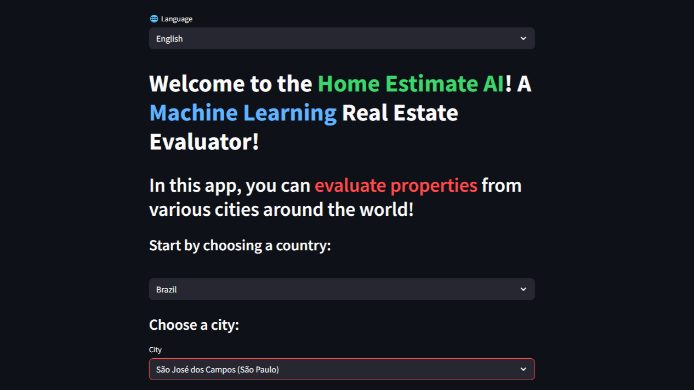
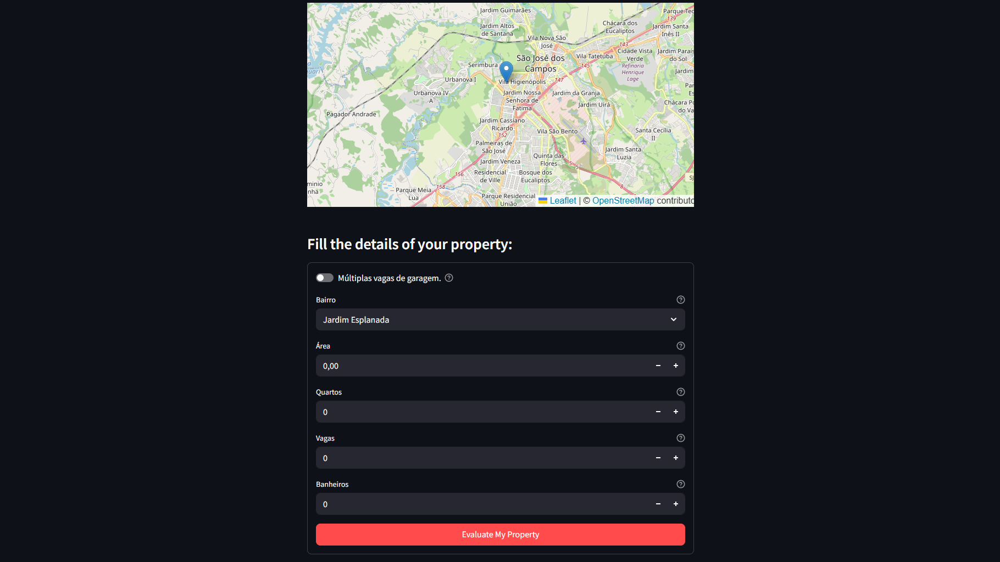
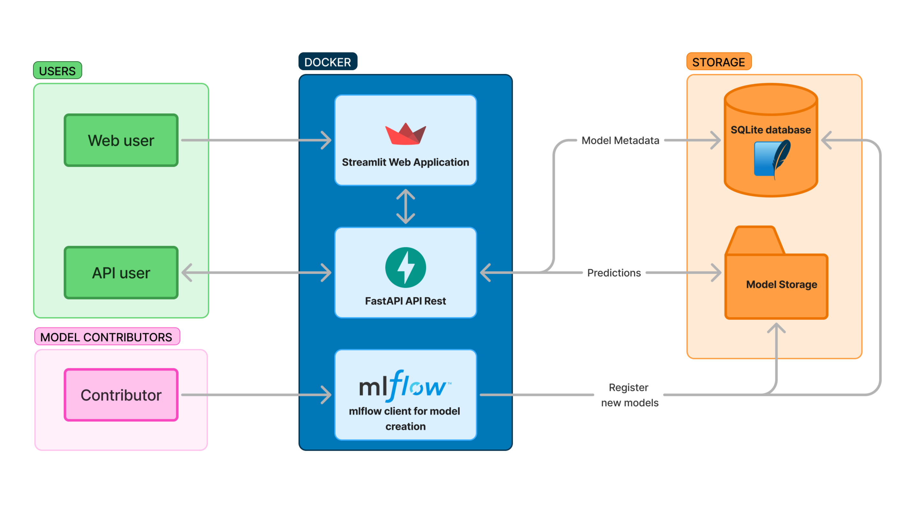

# House Estimate AI (App & API)


[](https://api.house-estimate-ai.uk/redoc)
[](https://house-estimate-ai.uk)


## 📌 Overview
House Estimate AI is a collaborative project featuring both an **API** and a **web application**, designed to provide property value estimates for cities worldwide.

## ✨ Features
- Estimate property values using machine learning models, accessible via API or web application.

## 🎯 Project Goals

- Allowing people to easily get a quick, approximate idea of their property's value, without having to sign up for a loan startup’s mailing list.
- Help beginners in data science contribute to an open source project.

## 📋 Summary
- [🚀 Getting Started](#-getting-started)
  1. [Accessing and using the Web App](#accessing-and-using-the-web-app)
  2. [Using the API](#accessing-the-api)
- [📂 Project structure](#-project-structure)
- [🛠️ Project stack](#-project-stack)
- [🤝Contributing](#-contributing)
- [🎯 To Do](#-to-do)
- [📄 License](#-license)

## 🚀 Getting Started

### Accessing and using the Web App

1. Start by accessing the application [here](https://www.home-estimate-ai.uk/)
2. Select your preferred language.
3. Choose the country and city of the property you want to evaluate.



4. Fill the details and click in the button at the end to evaluate your property.



### Accessing the API

You can access the API documentation, including a **Getting Started tutorial**, [here](https://api.home-estimate-ai.uk/redoc).

## 📂 Project Structure
```
house-price-app/
│   docker-compose.dev.yml
│   LICENSE
│   README.md
│
├── api/                  # API layer (schemas, routes)
│   └── api.py
│
├── app/                  # Web application (streamlit, api client)
│   ├── main.py
│   └── client.py
│
├── database/             # DB init, connection, schema, queries & CRUD
│   └── init_db.py
│
├── mlflow_client/        # Model management & dev assistant
│   └── model_logging.py
│   └── ingestion.py
│
├── model_development/    # Area for developing new ML models
│
├── examples/             # Example data, notebooks (model creation tutorial)
│   └── creating_model.ipynb
│
├── docs/                 # Documentation & readme assets
│
├── requirements/         # Dependency files
│
├── tests/                # Unit tests
│
└── tmp/                  # Temporary folder (db, ingestion, and storage)
```

## 🛠️ Project Stack
- [Python 3.13](https://www.python.org/) (Main Language)
- [Streamlit](https://streamlit.io/) (Web App)
- [FastAPI](https://fastapi.tiangolo.com/) (API)
- [Pytest](https://docs.pytest.org/) (Tests)
- [Docker](https://www.docker.com/) (Containers)
- [MLflow](https://mlflow.org/) (Machine Learning)
- [SQLite](https://www.sqlite.org/) (Database)

## 🏗️ Project Architecture

The Project is divided into three main services and four python modules:

- `api` service is responsible for the Fast API server, schemas and database connections

- `app` service is responsible for the streamlit application and the client to consume the api (it uses a docker network instead public internet)
- `mlflow_client` service has a series of tools to assist our contributors with model development.

All these services are also python packages. The last main python package is `database`, wich is used to connect and query the SQLite database used in the project. It is available only for `api` and `mlflow_client` services.

The image bellow shows a summary of the project architecture. You can dive into details by acessing the docs of each module in the [docs folder](./docs/)



## 🤝 Contributing

There are several ways to contribute to the project. You can add new models, make code contributions, or even translate the app into your language. Before moving on to the suggested tasks, make sure you know how to run the project locally:

### Prerequisites

Before running the project, make sure you have the following installed:

- [Docker](https://www.docker.com/)
- [Docker Compose](https://docs.docker.com/compose/)
- [VSCode](https://code.visualstudio.com/) (Optional)
- [Remote - Containers (VSCode extension)](https://marketplace.visualstudio.com/items?itemName=ms-vscode-remote.remote-containers)

> **Note:** Using VSCode and Dev Containers is highly recommended for an optimal development experience. While not required, it simplifies setup and ensures a consistent environment. 

The project uses **Python 3.13** inside the Docker container, so you do **not** need Python installed locally. All Python dependencies are listed in the `requirements/` folder and will be installed automatically when building the Docker image.

### Getting Started Locally

> ⚠️ if you are a **model contributor** jump to [2. Clone the repository](#2-clone-the-repository).

#### 1. Fork the repository

1. Go to the [GitHub repository page](https://github.com/marcuszucareli/house-price-app).  
2. Click the **Fork** button at the top right.  

#### 2. Clone the repository
```bash
# If you are a model contributor
git clone https://github.com/marcuszucareli/house-price-app.git

# If you are coder/translator contributor (forked the repo)
git clone https://github.com/YOUR_USER/house-price-app.git
```

#### **2. Run the project**

#### 2.1 Using Dev Containers (recommended)

>💡 You can learn more about them [here](https://code.visualstudio.com/docs/devcontainers/containers).

1. Open the project folder in **Visual Studio Code**.
2. If prompted, click **"Reopen in Container"** to start the Dev Container. This will build a container with all dependencies installed and configure VS Code extensions automatically.
3. If the **"Reopen in Container"** option does not appear:
   - Make sure you have the **Remote - Containers** extension installed.
   - Open the Command Palette (`Ctrl+Shift+P` or `Cmd+Shift+P`) and select **Remote-Containers: Reopen in Container**.

#### 2.2 Using Docker Compose

1. Make sure you have **Docker** and **Docker Compose** installed.
2. From the project root, run:  

```bash
docker-compose -f docker-compose.dev.yml up --build
```

### ✅ **All set!**

The project is now running locally with the services `api`, `app` and `mlflow_client`:

- **API Docs:** http://localhost:8000/redoc
- **Web App:** http://localhost:8080

### Choose your contribution

With your local environment setup, you can read the guidelines/tutorials for each contribution type. But before jumping into any file, you my want to check our [Project To-Dos](#🎯-to-do).

- [🏗 Model Contributions](./examples/creating_model.ipynb)
- [💻 Code Contributions](./docs/contributing/code.md)
- [🌐 Translations](./docs/contributing/translations.md)

## 🎯 To Do

Here are some recommended next steps for each area of contribution:

***Models***
> - Deploy your already done model
> - Develop a model for a major city in `Australia`
> - Develop a model for a major city in `China`
> - Develop a model for a major city in `South Africa`
> - Develop a model for a major city in the `USA`
 
***Code***
> 
> - *General*
>   - Implement logging system
>   - Refactor tests to make them more modular and maintainable
> 
> - *API*
>   - Implement authentication
>   - Implement rate limit
>   - Add functionality to record or track requests, along with relevant details like model, time, and input values.
>   - Write tests that are expected to fail for the API
>   - Create a model class and handle API response statuses beyond 200
> 
> - *Database*
>   - Create a table to store track requests
> 
> - *Web App*
>   - Implement a visible loading indicator (spinner, progress bar, or placeholder) while the model prediction is being generated
>   - Create tests for API client
>   - Mock API prediction call to test the results page without having to fake fill the form in the main page.
 
***Translations***
> - Create Arabic translations
> - Create Chinese translations
> - Create German translations
> - Create Russian translations
> - Create Spanish translations

## 📄 License  
This project is licensed under the [MIT License](./LICENSE), allowing wide usage and contributions.
