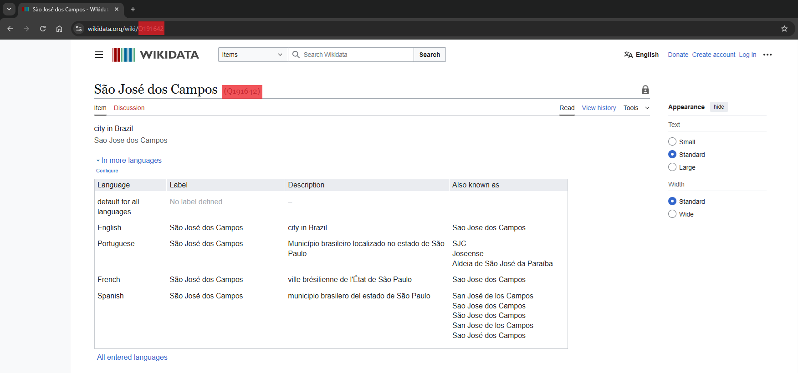

## About

Welcome to the Home Estimate AI API. This API is part of a 
[larger project](https://github.com/marcuszucareli/house-price-app) that 
includes a 
[web application](https://home-estimate-ai.uk) and is maintained by our 
contributors under an open source model.

Here you can estimate properties prices using Machine Learning Models from 
different cities around the world.

## Features

- Query models by metrics, countries and cities
- Estimate the price of a property

## Getting Started

In order to estimate the price of a property, you will need the ID of the 
model you want to use. Models are ultimately linked to cities, which is why we 
encourage you to use the city to search for the appropriate model.

### Finding a model

Let's explore the models for the welcoming city of São José dos Campos in Brazil.
To do this, you will need the city's `Wikidata ID`. You can find it by visiting 
the [Wikidata website](https://www.wikidata.org) and searching for the city.
The ID appears both next to the city's name on its page and in the page URL, 
as shown in the image below:



Now that we have the city wikidata id, we can use the endpoint to get the Machine 
Learning models associated with this city.

```python
import requests

# Request URL
url = "{API_BASE_URL}/models/"

# Params
params = {{
    "city": "Q191642",
    "sortBy": "year" # You can also sort by the metrics mae, mape, r2 and rmse
}}

# Call the API
response = requests.get(url, params=params)

# Get the json data
data = response.json()
```

The response include model's metrics, author, algorithm and its id, wich we'll
 be using to make a prediction

```json
{{
  "models": [
    {{
      "id": "55555555-5555-5555-5555-555555555555",
      "flavor": "sklearn",
      "data_year": 2024,
      "mae": 96,
      "mape": 0.96,
      "r2": 0.96,
      "rmse": 0.96,
      "algorithm": "random forest",
      "author": "Marcus Zucareli",
      "links": {{
        "Linkedin": "https://www.linkedin.com/"
      }}
    }},
    {{
      "id": "00000000-0000-0000-0000-000000000000",
      "flavor": "sklearn",
      "data_year": 1999,
      "mae": 99,
      "mape": 0.99,
      "r2": 0.99,
      "rmse": 0.99,
      "algorithm": "regression",
      "author": "Edson Arantes do Nascimento",
      "links": {{
        "Github": "https://github.com/",
        "Linkedin": "https://www.linkedin.com/"
      }}
  ]
}}
```

### Getting and preparing inputs

As you could see in the json above, there are two models for the city, let's 
use the firt, since it is the most recent one.
Now we have to get the inputs that the model needs in order to compute its 
prediction for our property.
You can get the inputs using the `inputs` endpoint

```python
import requests

model_id = "55555555-5555-5555-5555-555555555555"

# Request URL
url = "{API_BASE_URL}/inputs/{{model_id}}"

# Call the API
response = requests.get(url)

# Get the json data
data = response.json()
```

In the JSON below, you can see that the model requests several types of inputs.  
Each input has a `type`, which can be `int`, `float`, `bool`, `categorical`, or
 `map`.  

- *int*, *float*, and *bool* must be provided using their respective types.  
- *categorical* requires using one of the options provided in the `options` 
parameter.  
- *map* is a special input type that requires the latitude and longitude of the
 property, both sent as floats.

```json
{{
  "inputs": [
    {{
      "models_id": "55555555-5555-5555-5555-555555555555",
      "column_name": "has_multiple_parking_spaces",
      "lat": "",
      "lng": "",
      "label": "Múltiplas vagas de garagem.",
      "type": "bool",
      "options": [],
      "description": "Se o seu imóvel possui mais de uma vaga de garagem.",
      "unit": null
    }},
    {{
      "models_id": "55555555-5555-5555-5555-555555555555",
      "column_name": "neighbourhood",
      "lat": "",
      "lng": "",
      "label": "Bairro",
      "type": "categorical",
      "options": [
        "Jardim Esplanada",
        "...",
        "Outros"
      ],
      "description": "Bairro do seu imóvel.",
      "unit": null
    }},
    {{
      "models_id": "55555555-5555-5555-5555-555555555555",
      "column_name": "area",
      "lat": "",
      "lng": "",
      "label": "Área",
      "type": "float",
      "options": [],
      "description": "Tamanho do imóvel.",
      "unit": null
    }},
    {{
      "models_id": "55555555-5555-5555-5555-555555555555",
      "column_name": "rooms",
      "lat": "",
      "lng": "",
      "label": "Quartos",
      "type": "int",
      "options": [],
      "description": "Número de quartos do imóvel.",
      "unit": null
    }},
    {{
      "models_id": "55555555-5555-5555-5555-555555555555",
      "column_name": "parking",
      "lat": "",
      "lng": "",
      "label": "Vagas",
      "type": "int",
      "options": [],
      "description": "Número de vagas do imóvel.",
      "unit": null
    }},
    {{
      "models_id": "55555555-5555-5555-5555-555555555555",
      "column_name": "bathrooms",
      "lat": "",
      "lng": "",
      "label": "Banheiros",
      "type": "int",
      "options": [],
      "description": "Número de banheiros do imóvel.",
      "unit": null
    }},
    {{
      "models_id": "55555555-5555-5555-5555-555555555555",
      "column_name": "",
      "lat": "lat_value",
      "lng": "lon_value",
      "label": "Coordenadas",
      "type": "map",
      "options": [],
      "description": null,
      "unit": null
    }}
  ]
}}
```

### Getting prediction

To make a prediction using the model, create a JSON object where each key corresponds to the `column_name` of an input, and the value is the property value for that parameter.  

⚠️ **Attention – Inputs of type `map`:**  
For these inputs, instead of using `column_name`, you will create **two separate parameters** in the prediction JSON, one using input's `lat` parameter and the other using `lng` parameter:

- The key for latitude will be the value of the input's `lat` key, and its value should be the property's latitude as a float.  
- The key for longitude will be the value of the input's `lng` key, and its value should be the property's longitude as a float.  

```json
"features": {{
  "area": 90,
  "bathrooms": 1,
  "has_multiple_parking_spaces": true,
  "lat_value": -23.1789,
  "lon_value": -45.8869,
  "neighbourhood": "Jardim Esplanada",
  "parking": 2,
  "rooms": 3
}}
```

Here, `"lat_value"` and `"lon_value"` come from the `lat` and `lng` fields of the *map* input, and the values are the actual coordinates of the property.
Other inputs like `"area"` and `"bathrooms"` use their `column_name` directly.
Also, `"neighbourhood"` uses one of the options of its options parameter.

Now, once the prediction JSON is prepared, we just need to include it inside another JSON under the key `"features"` and send the POST request to the predict endpoint to get the property value.

```python
import requests
import json

url = "{API_BASE_URL}/predict/55555555-5555-5555-5555-555555555555"

payload = {{
  "features": {{
    "area": 90,
    "bathrooms": 1,
    "has_multiple_parking_spaces": True,
    "lat_value": -23.1789,
    "lon_value": -45.8869,
    "neighbourhood": "Jardim Esplanada",
    "parking": 2,
    "rooms": 3
  }}
}}

response = requests.post(url, json=payload)

data = response.json()

```

And here it is! The prediction to your property will be in the property_price parameter, as well as the mape (mean absolute percentage error) of the model.


```json

{{
    "predict": {{
        "mape": 0.96,
        "property_price": 509397.27
    }}
}}
```

More information can be found in the [Docs](/redoc#tag/Health) section. You can also or you can also [Try it here](/docs).