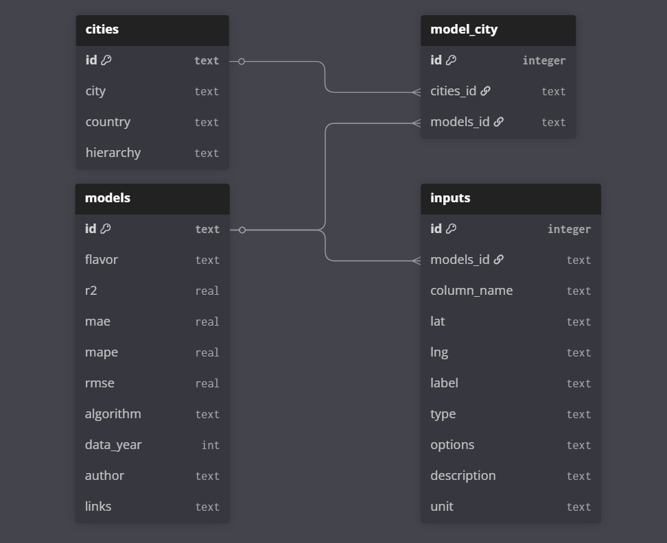

# Database

## About the module

The database module is used to store models' metadata, their cities and inputs. Given the simplicity of the data, we choose SQLite as our platform.

## Schema
The database schema is saved as [SQL file](../database/schemas.sql) and comprehends 4 tables:

- **models** store metadata from project's models
- **cities** stores the cities metadata of project's models
- **model_city** defines relations between a model and its cities
- **inputs** stores the necessary inputs to predict a value for each model



## CRUD

The CRUD file has a few functions to fetch data and execute queries without worrying with connection. If you still need create an independent connection, you can import the [connection file](../database/connection.py)

## Initializing

The init_db function handles the database file creation and is automatically called by docker-compose when starting containers. In dev environments, it will exclude and recreate the file everytime the container starts. If you want to reset the dev database while on devcontainer use the command bellow:

```bash
python -m database.init_db
```

It uses the [dev_db.sql](../database/dev_db.sql) file to populate the dev database with the standard scenarios listed in [conftests](../tests/conftest.py). In conftest you can also find the `write_sql_file()` function, wich will recreate the dev_db.sql using the data from the standard models and input cases in the same file.

## Dev Database 

Dev database is populated with 4 models, 6 cities and 5 basic inputs. The models’ IDs use a UUID format, but are composed of a single repeated digit. Models 1 to 3 are not attached to any real model and are just used to test database queries. Model 5 has a random forest model associated with it, saved in [examples folder](../examples/) and can be used to run predictions in tests. 

| Model Id | Cities | Inputs | Predict
|----------|----------|----------|----------|
| 0...0  | Belo Horizonte & Três Corações  | neighbourhood, is_new, n_bedrooms, area_m2, map | ❌ |
| 1...1  | Cambridge  | is_new, n_bedrooms, area_m2, map  | ❌ |
| 2...2  | Oslo & Bergen  | is_new, n_bedrooms, area_m2  | ❌ |
| 5...5  | São José dos Campos  | Note 1  | ✅ |

**Note 1:** For the real model inputs details see the [example notebook](../examples/creating_model.ipynb)

The inputs listed above cover all input types available for model creation.

| Input Name | Type        |
| ---------- | ----------- |
| n_bedrooms    | int         |
| area_m2    | float       |
| is_new    | bool        |
| neighbourhood    | categorical |
| Note 2    | map         |

**Note 2:** map input has no name because it uses "lat" and "lng" columns instead of column_name.

## Service Availability
Database module is available in mlflow_client and api services. The first one uses it to register new models, while the second to retrieve data during API calls.