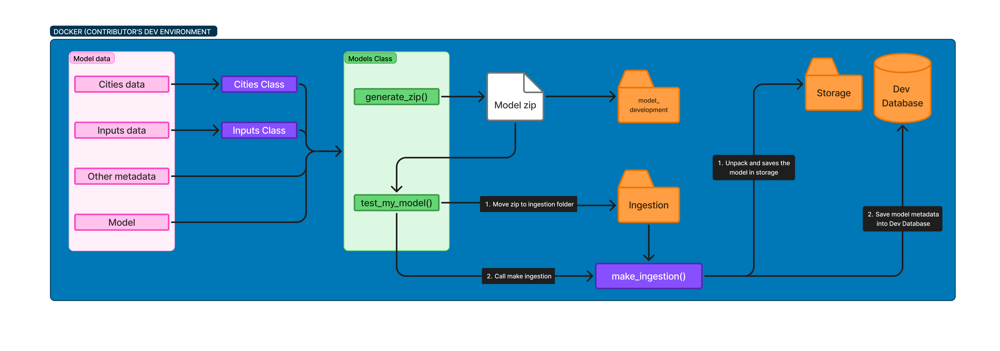

# mlflow_client

## About the module
This module has support classes to model development and model ingestion into database. The figure bellow shows the steps/data flow when creating and inserting a new model so you can interpret the functions of each class more easily.



## model_logging
The model_logging file defines classes to be used during the model development proccess. They validate inputs and assures compatibility with the project environment.

### Inputs
The Inputs class defines each input in a standardized way, ensuring it is [rendered with the appropriate widget](./app.md/#web-app) in the web app and providing the necessary metadata to construct the request body for the prediction API endpoint.

### Cities
The Cities class is used to standardized cities names and administrative hierarchy as well as using a reliable source for our primary key (in this case, city's wikidata id). This class relies on a call to the wikidata API.

### ModelLogInput
ModelLogInput is the class to validate all the metadata information of the model beeing created. If you can instantiate an object of this class, this means your model is compatible with our project. It calculates the metrics of the model and evaluate each metadata field during the post init method.

To help contributors and reviewers, some methods were implemented:
- `generate_zip()` will create a zip file with the model in a mlflow folder structure (to be readed with mlflow pyfunc method) and a json with the metadata to be inserted into the production database.
- `test_my_model()` will simulate a production environment: create the ingestion and storage folders, inserting the contributor's model in the dev database and making the [ingestion procedure](#ingestion)

# Ingestion
Ingestion file owns the `make_ingestion` function, responsible for unpacking the zip with the model and its metadata, copying the model to the storage folder and registering the metadata into the database.

> ⚠️ **Note:** The `make_ingestion` function supports a single file at a time in the ingestion folder.

## Setup
The setup file creates the dev environment (database + storage). It is automatically ran when the container starts, but if you need to restore original setup for any reason, use the command bellow on the api container:

```bash
python -m mlflow_client.setup
```